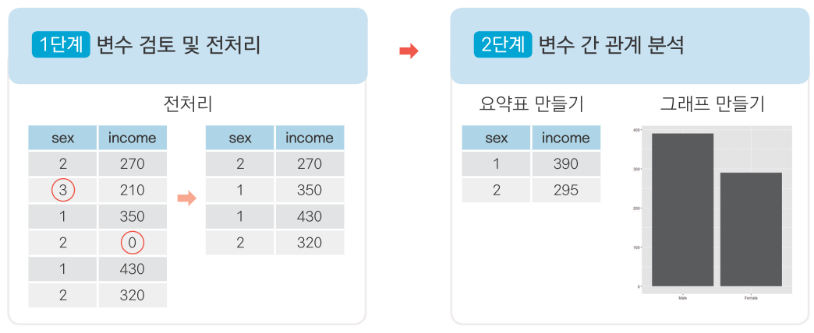

제목
================
작성자
July 30, 2020

# 한국인의 삶의 이해 ‘복지패널데이터’

한국복지패널데이터는 한국보건사회연구원에서 가구의 경제활동을 연구해 정책 지원에 반영할 목적으로발간하는 조사자료이다.

전국에서 7000여 가구를 선정해 2006년부터 매년 추적 조사한 자료로, 경제활동, 생활실태, 복지욕구 등 천여 개 변수로
구성되어 있다.

## 1\. 한국복지패널데이터 분석 준비하기

### 데이터 분석 준비하기

데이터를 분석하기 위한 준비작업

#### 1\. 데이터 준비하기

Koweps\_hpc10\_2015\_beta1.sav 파일을 다운로드해 프로젝트 폴더에 삽입한다. \#\#\#\# 2. 패키지
설치 및 로드하기 해당 파일은 spss 전용 파일로 되어 있다. foreign 패키지를 이용하여 파일을 불러온다.

``` r
install.packages("foreign")  # foreign 패키지 설치
library(foreign)             # SPSS 파일 로드
library(dplyr)               # 전처리
library(ggplot2)             # 시각화
library(readxl)              # 엑셀 파일 불러오기
```

#### 3\. 데이터 불러오기

foreign 패키지의 read.spss()를 이용해 복지패널데이터를 불러온다.

``` r
# 데이터 불러오기
raw_welfare <- read.spss(file = "Koweps_hpc10_2015_beta1.sav",
                         to.data.frame=T)

# 복사본 만들기
welfare <- raw_welfare
```

#### 4\. 데이터 검토하기

데이터의 구조와 특징을 파악하자

``` r
head(welfare)
tail(welfare)
View(welfare)
```

#### 5\. 변수명 바꾸기

분석에 사용할 몇 개의 변수를 이해하기 쉬운 변수명으로 바꾸자

``` r
welfare <- rename(welfare,
                  sex = h10_g3,
                  birth=h10_g4,
                  marriage=h10_g10,
                  religion=h10_g11,
                  code_job=h10_eco9,
                  income=p1002_8aq1,
                  code_region=h10_reg7)
```

### 데이터 분석 절차

  - 1단계. 변수 검토 및 전처리 가장 먼저 분석에 사용할 변수들을 전처리 한다. 변수의 특성을 파악하고 이상치를 정제한 다음
    파생변수를 만든다. 전처리는 분석에 활용할 변수 각각에 대해 실시한다.

  - 2단계. 변수 간 관계 분석 전처리가 완료되면 본격적으로 변수 간 관계를 파악하는 분석을 한다.
    
