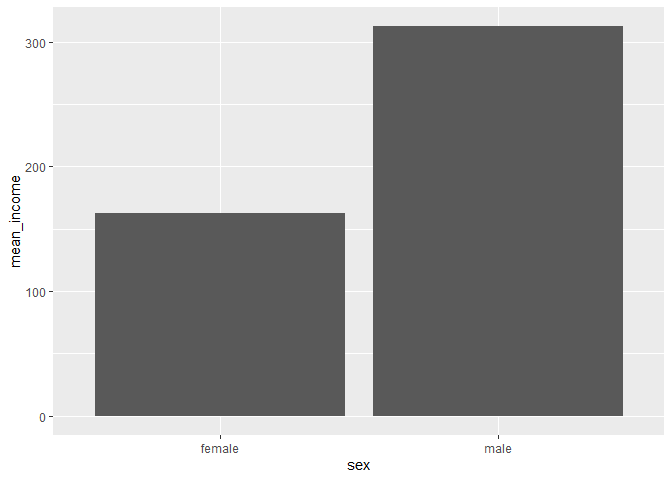

제목
================
작성자
July 30, 2020

## 2\. 성별에 따른 월급 차이

성별과 월급 두 변수를 검토, 전 처리하여 변수 간의 관계를 분석한다. \#\#\# 분석 절차

### 성별 변수 검토 및 전처리

#### 1\. 변수 검토하기

성별 변수의 타입을 파악하고, 각 범주에 몇 명이 있는지 확인

``` r
class(welfare$sex)
```

    ## [1] "numeric"

``` r
table(welfare$sex)
```

    ## 
    ##    1    2 
    ## 7578 9086

#### 2\. 전처리

성별 변수의 값 = 1, 남자 성별 변수의 값 = 2, 여자 결측값 = 9 데이터 이상치 검토, 이상치 제외=NA부여

``` r
welfare$sex <- ifelse(welfare$sex == 9, NA, welfare$sex)
table(is.na(welfare$sex))
```

    ## 
    ## FALSE 
    ## 16664

``` r
welfare$sex <- ifelse(welfare$sex == 1, "male","female")
table(welfare$sex)
```

    ## 
    ## female   male 
    ##   9086   7578

``` r
qplot(welfare$sex)
```

<!-- -->

### 월급 변수 검토 및 전처리

#### 1\. 변수 검토하기

``` r
class(welfare$income)
```

    ## [1] "numeric"

``` r
summary(welfare$income)
```

    ##    Min. 1st Qu.  Median    Mean 3rd Qu.    Max.    NA's 
    ##     0.0   122.0   192.5   241.6   316.6  2400.0   12030

``` r
qplot(welfare$income)
```

    ## `stat_bin()` using `bins = 30`. Pick better value with `binwidth`.

    ## Warning: Removed 12030 rows containing non-finite values (stat_bin).

<!-- --> \#\#\#\#
2. 전처리

``` r
summary(welfare$income)
welfare$income <- ifelse(welfare$income %in% c(0,9999), NA, welfare$income)
table(is.na(welfare$income))
```

### 성별에 따른 월급 차이 분석하기

#### 1\. 성별 월급 평균표 만들기

``` r
sex_income <- welfare %>% filter(!is.na(income)) %>% 
group_by(sex) %>% 
summarise(mean_income=mean(income))
```

    ## `summarise()` ungrouping output (override with `.groups` argument)

``` r
sex_income
```

    ## # A tibble: 2 x 2
    ##   sex    mean_income
    ##   <chr>        <dbl>
    ## 1 female        162.
    ## 2 male          312.

#### 2\. 그래프 만들기

``` r
ggplot(data=sex_income, aes(x=sex, y=mean_income)) + geom_col()
```

<!-- -->
